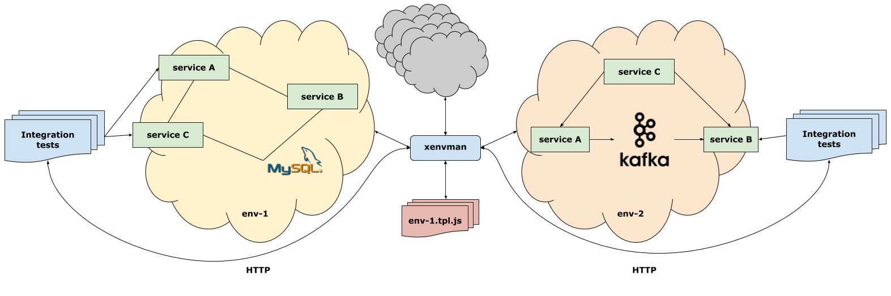

[](https://travis-ci.org/syhpoon/xenvman)
[](https://codecov.io/gh/syhpoon/xenvman)

Table of Contents
=================

   * [Overview](#overview)
   * [Installation](#installation)
      * [Download release](#download-release)
      * [Compilation from source](#compilation-from-source)
      * [Configuration](#configuration)
      * [Running API server](#running-api-server)
   * [Environments](#environments)
   * [Templates](#templates)
      * [Data directory](#data-directory)
      * [Workspace directory](#workspace-directory)
      * [Mount directory](#mount-directory)
      * [Template directories summary](#template-directories-summary)
      * [Javascript API](#javascript-api)
         * [Template format](#template-format)
         * [Template API](#template-api)
            * [BuildImage(name :: string) -&gt; <a href="#BuildImage-API">BuildImage</a>](#buildimagename--string---buildimage)
            * [FetchImage(name :: string) -&gt; <a href="#FetchImage-API">FetchImage</a>](#fetchimagename--string---fetchimage)
            * [AddReadinessCheck(name :: string, params :: object) -&gt; null](#addreadinesscheckname--string-params--object---null)
         * [BuildImage API](#buildimage-api)
            * [CopyDataToWorkspace(path :: string...) -&gt; null](#copydatatoworkspacepath--string---null)
            * [AddFileToWorkspace(path :: string, data :: string, mode int) -&gt; null](#addfiletoworkspacepath--string-data--string-mode-int---null)
            * [InterpolateWorkspaceFile(file :: string, data :: object) -&gt; null](#interpolateworkspacefilefile--string-data--object---null)
            * [NewContainer(name :: string) -&gt; <a href="#Container-API">Container</a>](#newcontainername--string---container)
         * [FetchImage API](#fetchimage-api)
            * [NewContainer(name :: string) -&gt; <a href="#Container-API">Container</a>](#newcontainername--string---container-1)
         * [Container API](#container-api)
            * [SetEnv(env, val :: string) -&gt; null](#setenvenv-val--string---null)
            * [SetLabel(key :: string, value :: {string, number}) -&gt; null](#setlabelkey--string-value--string-number---null)
            * [SetCmd(cmd :: string) -&gt; null](#setcmdcmd--string---null)
            * [SetPorts(port :: number...) -&gt; null](#setportsport--number---null)
            * [MountString(data, contFile :: string, mode :: int, opts :: object) -&gt; null](#mountstringdata-contfile--string-mode--int-opts--object---null)
            * [MountData(dataFile, contFile :: string, opts :: object) -&gt; null](#mountdatadatafile-contfile--string-opts--object---null)
         * [Readiness checks](#readiness-checks)
         * [Helper JS functions](#helper-js-functions)
            * [fmt](#fmt)
            * [lib](#lib)
            * [type](#type)
      * [Interpolation](#interpolation)
         * [Workspace files](#workspace-files)
         * [Mounted files](#mounted-files)
         * [Readiness checks](#readiness-checks-1)
   * [HTTP API](#http-api)
   * [Clients](#clients)
      * [Golang](#golang)

# Overview

`xenvman` is an extensible environment manager which is used to
create environments for testing microservices.



xenvman can be used to:

* Define environment templates using JavaScript
* Create images on the fly
* Spawn as many containers as needed inside an environment
* Link containers together in a single isolated network
* Expose container ports for external access

For a detailed example take a look at [tutorial](docs/tutorial.md).

# Installation

## Download release

## Compilation from source

In order to compile `xenvman` from source one must have installed
[Golang](https://golang.org/) with the minimum version of `1.11`.

`xenvman` uses new feature introduced in Go version `1.11` - 
[Modules](https://github.com/golang/go/wiki/Modules) and so you can
clone the sources anywhere, no need to do it into `$GOPATH`.

So the build process is super simple:
```bash
$ cd ~ && git clone https://github.com/syhpoon/xenvman.git && cd xenvman
$ make test && make build
```

If everything is good, there will be a `xenvman` executable in the project root,
which you can copy anywhere in your `$PATH` and that would be it.

## Configuration

## Running API server

# Environments

Environment is an isolated bubble where one or more containers can be run 
together in order to provide a necessary playground for infrastructure testing.

Environments are created, managed and destroyed using HTTP API provided
by running `xenvman` server.

# Templates

An environment is set up by executing one or more templates,
where a template is a a small program written in JavaScript
which defines what images to build/fetch, what and how many containers
to spawn, what files to mount inside containers, what ports to expose etc.

A template script is run by embedded JS interpreter inside `xenvman` server.
One template is just one javascript file located within a template base directory (defined by `tpl.base-dir` configuration parameter, or `XENVMAN_TPL.BASE_DIR` environment variable).

A template file name must follow the format: `<name>.tpl.js` and can be located
either directly within tpl base dir or in any sub-directory.

A fully qualified template name consists of javascript file name without `.tpl.js` suffix, preceeded by directory names relative to template base dir.

To make it clear, let's consider a simple example.
Let's say our base dir is `/opt/xenvman/base` and it looks like this:

```
/opt/xenvman/base/
   db/
      mysql.tpl.data/
      mongo.tpl.data/
      mysql.tpl.js
      mongo.tpl.js
   custom.tpl.data/
      Dockerfile
      custom.yaml
   custom.tpl.js
```

So here we have three templates with fully qualified names:
`db/mysql`, `db/mongo` and `custom`.

## Data directory

There's usually a bunch of files needed by template like Dockerfile to build
images on the fly, configuration templates, required modules, shared libraries
etc. All those files must be placed in a special directory called
`template data directory` (or just `data dir` for short).
Data dir must be located inside the same dir where template file is
and must be named using the following format: `<name>.tpl.data`, where `<name>`
is the same template name as in main json file.

Template javascript API provides functions to copy files from data dir to image
workspace, mount them inside containers etc.

Please note, that all files in data directory are never changed
by a template, they are always copied when needed.

## Workspace directory

Because `xenvman` allows you to build docker images on the fly,
there are often files you'd want to include in the image.
All those files are collected in a special temporary dir called
`workspace`. A workspace is a temporary directory, separately created for 
any image your template is trying to build during template execution.
The only required file is a Dockerfile itself, which describes what kind of
image you're building.

## Mount directory

A `mount directory` is a temporary dir created for every container
the template wants to run and holds files which will be mounted inside
the container. You can create files in a mount dir by either copying
them from a data dir (using container JS API) or by using data from template runtime parameters.

## Template directories summary

The following picture provides a general view of template directories
and their relations.


## Javascript API

As mentioned above, a template is a JavaScript program which
uses special API to configure required environment.
Let's take a closer look at template shape and form.

`Please note`: `xenvman` uses an embedded [JS interpreter](https://github.com/robertkrimen/otto), which implies certain limitations as compared
to running JS in a browser or in node.js ecosystem:

* No DOM-related functions
* `"use strict"` will parse, but does nothing
* The regular expression engine (re2/regexp) is not fully compatible with the ECMA5 specification
* Only ES5 is supported. ES6 features (eg: Typed Arrays) are not available

### Template format

A template must define an entry point function:

`function execute(tpl, params) {}`

This function is expected to provide necessary instructions in order
to configure an environment.

First parameter, `tpl`, is a [template instance](#Template-API), while
`params` is an arbitrary key-value object which is used to 
configure template by the caller.

`Please note`: calling tpl instance functions, such as `BuildImage`,
`FetchImage` etc. does not cause these actions to occur immediately,
instead they are scheduled and performed at later stages, after
JS execution phase.

### Template API

Template instance, which is passed as a first argument has the following methods:

#### BuildImage(name :: string) -> [BuildImage](#BuildImage-API)

Instucts `xenvman` to build a new image with the given name.
`name` parameter is the resulting Docker image name.

Return value is a [BuildImage](#BuildImage-API) instance.

#### FetchImage(name :: string) -> [FetchImage](#FetchImage-API)

Instructs `xenvman` to fetch an existing image from public or 
private image repository.
 
The `name` is a fully-qualified docker image name, including
repository address and tag, that is the same format is expected as
for regular `docker pull` invocation.

For private repos, existing credentials (acquired by `docker login`)
are used by the user who started `xenvman` server.

#### AddReadinessCheck(name :: string, params :: object) -> null

Adds a new [readiness check](#Readiness-checks) for the current template.

### BuildImage API

BuildImage instance represents an image which `xenvman` is going to build
on the fly. Files included in the image can be either copied from a
[template data dir](#Data-directory) or by supplying data for files in
template HTTP parameters.

#### CopyDataToWorkspace(path :: string...) -> null

This function takes a variable list of FS object names from data dir
and copies them into [image workspace](#Workspace-directory).
Object names must be relative to the data dir.
For example, if data dir contained the following files:

```
<data-dir>/
   subdir/
      subfile.png
   file1.json
```

then the paths would be: `subdir/subfile.png` and `file1.json`.

A special value `*` can be provided in order to copy every object from
data dir.

#### AddFileToWorkspace(path :: string, data :: string, mode int) -> null

Sometimes you want to dynamically include some file into the image
which is different every time you build it. So it cannot be simply
placed into data dir. Imagine you've patched some microservice
and want to test it, you can simply include the binary itself
(assuming your microservice is written in a compiled language)
in the HTTP request as a template parameter and by calling
`AddFileToWorkspace` it will be copied to image workspace.

* `path` argument is a path inside an image where to save the data.
* `data` is the data itself as a binary/string. Usually it is base64-encoded
  during HTTP transfer and then decoded back using `type.FromBase64()`
  js function.
* `mode` is a standard Unix file mode as an octal number.  

#### InterpolateWorkspaceFile(file :: string, data :: object) -> null

Instructs `xenvman` to interpolate a file in a workspace dir (that is
it must already be copied there before).

* `file` is a file path relative to workspace dir.
* `data` is an object providing values for interpolation.

[More details about interpolation](#Interpolation).

#### NewContainer(name :: string) -> [Container](#Container-API)

Create a new container with a given name from the image instance.

### FetchImage API

FetchImage instance represents an image which will be fetched by
`xenvman` (using Docker). Because in this case the image is already built
the amount of possible actions is limited as compared to building a new
image from scratch. Basically the only possible modification is mounting
files into the container from the host ([Mount dir](#Mount-directory)).

#### NewContainer(name :: string) -> [Container](#Container-API)

Create a new container with a given name from the image instance.

### Container API

#### SetEnv(env, val :: string) -> null
#### SetLabel(key :: string, value :: {string, number}) -> null
#### SetCmd(cmd :: string) -> null
#### SetPorts(port :: number...) -> null
#### MountString(data, contFile :: string, mode :: int, opts :: object) -> null
#### MountData(dataFile, contFile :: string, opts :: object) -> null

### Readiness checks

### Helper JS functions

In addition to image and container specific APIs there are also some
additional helper modules which can be used directly anywhere in the template
script.

#### fmt
#### lib
#### type

## Interpolation
### Workspace files
### Mounted files
### Readiness checks

# HTTP API

# Clients
## Golang
